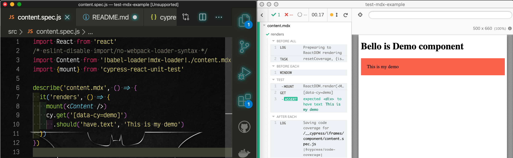

# test-mdx-example

 

Testing MDX components using Cypress and [cypress-react-unit-test](https://github.com/bahmutov/cypress-react-unit-test)

To run

```
yarn
```

Then from `cypress/cypress` repo switch to branch `issue-5922-mountMode` and open this project

```
yarn dev --project <path to this folder>
```


